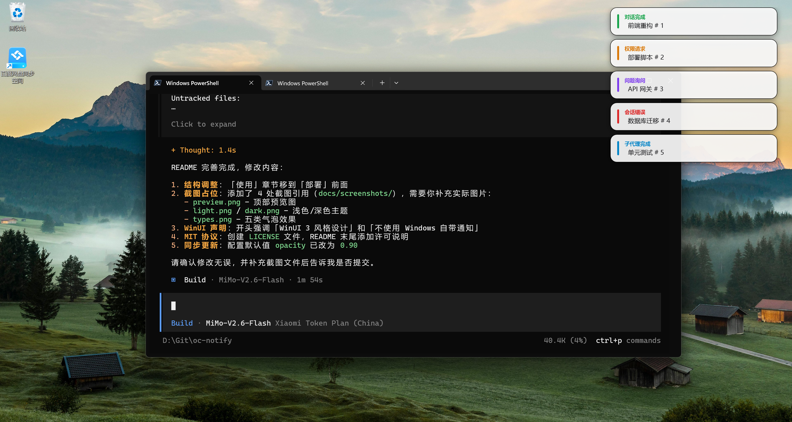

# oc-notify

[English](README.en.md) | **简体中文**

[](LICENSE)


为 **[opencode](https://opencode.ai) CLI** 定制的桌面气泡通知工具：对话完成、权限请求、AI 提问、会话错误、子代理完成时，在屏幕角落弹出现代化气泡提醒。

- **✨ WinUI 3 风格设计** — 微软 Fluent Design 设计语言：圆角卡片、流畅动画、毛玻璃观感
- **🚫 不依赖 Windows Toast** — 完全自绘 WPF 透明窗口，样式自由、动画流畅、不受系统通知限制
- **🧠 智能防打扰** — 仅在 opencode 非前台时弹窗，内置短任务过滤与权限消抖，安静不刷屏
- **⚡ 零配置上手** — 一键部署，全配置热更新，保存即生效



## 目录

- [功能特性](#功能特性)
- [环境要求](#环境要求)
- [快速开始](#快速开始)
- [使用](#使用)
- [配置参考](#配置参考)
- [故障排查](#故障排查)
- [架构与原理](#架构与原理)
- [开发指南](#开发指南)
- [项目结构](#项目结构)
- [许可](#许可)

---

## 功能特性

### 五类提醒事件（均可单独开关）

| type | 触发时机 | 深色主题分类色 |
|------|----------|----------------|
| `sessionIdle` | AI 一轮回复完成（`session.idle`） | 绿 `#4ADE80` |
| `permissionAsk` | 需要用户批准权限（`permission.asked`） | 琥珀 `#FBBF24` |
| `questionAsk` | AI 向你提问（`question.asked`） | 紫 `#A78BFA` |
| `sessionError` | 会话出错（`session.error`） | 红 `#F87171` |
| `subagentDone` | 子代理/子任务完成（idle 且存在 `parentID`） | 蓝 `#38BDF8` |

标签随 `style.language` 切换：默认中文（对话完成 / 权限请求 / …），`en` 时显示 Done / Permission / Question / Error / Subagent Done。

### 气泡 UI（WinUI 3 / Fluent Design）

- **精美卡片**：分类色条 + 标签 + 会话标题 + 圆角 + 阴影，层次分明
- **四角停靠**：`top-left` / `top-right`（默认）/ `bottom-left` / `bottom-right`
- **堆叠规则**：上方两角新气泡向下叠加、旧卡消失其余上移；下方两角反之
- **流畅动画**：进入滑入淡入 → 超时/点击渐隐收拢
- **双主题**：`light`（默认）/ `dark`，分类色自动切换保证对比度
- **毛玻璃观感**：卡片半透明 + 亮描边（窗口本体始终全透明）
- **多气泡**：同屏最多 `maxVisible` 条，超出挤出最旧；点击可关闭

### 智能行为

- **仅非前台弹窗**（`onlyWhenInactive`，默认开）：opencode/终端处于前台时不打扰
- **反误报**：error 后 2s 内的 idle 不二次弹窗；busy→idle 不足 2s 视为短任务跳过；权限请求 300ms 消抖
- **自动生命周期**：首个 CLI 启动自动拉起 `OcNotify.exe`；全部退出后约 60s 自动关闭；单实例防重复
- **全配置热更新**：改 JSON 即时生效，无需重启

---

## 环境要求

| 项 | 要求 |
|----|------|
| OS | Windows 10/11（透明与定位不依赖 Win11；毛玻璃/系统圆角在 Win11 最佳） |
| .NET | .NET 8 **Desktop Runtime**（x64） |
| opencode | v1.18+（v1 插件接口 `@opencode-ai/plugin`） |

插件运行在 opencode 内置 Bun 中，**无需**单独安装 Node/Bun。

---

## 快速开始

### 方式一：一键部署（推荐）

仓库 [`deploy/`](deploy/) 目录内含完整部署包：

```
deploy/
├── install.bat                 ← 双击运行
└── files/                      ← 部署所需的全部文件
    ├── notify-bubble.ts        插件
    ├── oc-notify.default.json  默认配置模板
    └── OcNotify/               气泡程序（exe + dll + 依赖）
```

1. **确认 .NET 8 Desktop Runtime（x64）已安装**
   - 脚本会自动检测；未安装时提示下载地址后退出
   - 下载页：<https://dotnet.microsoft.com/download/dotnet/8.0>
   - 选择 **".NET Desktop Runtime 8.0.x (x64)"**（不是 ASP.NET Runtime，也不是仅 Runtime）
2. **双击 `deploy\install.bat`**
3. 脚本自动完成：检测运行时 → 停止正在运行的 `OcNotify.exe` → 复制插件 / 程序 / 配置 → 打印部署报告
4. **重启 opencode CLI**（插件仅在启动时加载）
5. 按下方 [使用](#使用) 验证

**目标位置**（脚本自动创建）：

| 源文件 | 目标 |
|--------|------|
| `files\notify-bubble.ts` | `%USERPROFILE%\.config\opencode\plugins\notify-bubble.ts` |
| `files\OcNotify\*` | `%USERPROFILE%\.config\opencode\assets\OcNotify\` |
| `files\oc-notify.default.json` | `%USERPROFILE%\.config\opencode\oc-notify.json` |

> **配置保护**：若 `oc-notify.json` 已存在，脚本**跳过不覆盖**，保留你的现有配置。

**升级**：重新双击 `install.bat` 覆盖插件与程序文件，然后重启 opencode。

### 方式二：手动部署（PowerShell）

从仓库根目录执行：

```powershell
$cfg  = "$env:USERPROFILE\.config\opencode"
$exe  = "$cfg\assets\OcNotify"
$plug = "$cfg\plugins"

New-Item -ItemType Directory -Force -Path $exe, $plug | Out-Null

# 1. 发布气泡程序
dotnet publish src\OcNotify\OcNotify.csproj -c Release -o $exe /p:DebugType=none

# 2. 部署插件
Copy-Item src\plugin\notify-bubble.ts $plug -Force

# 3. 配置（仅首次；已有配置请勿覆盖）
if (-not (Test-Path "$cfg\oc-notify.json")) {
  Copy-Item config\oc-notify.default.json "$cfg\oc-notify.json"
}
```

### 部署后验证

```powershell
# 启动程序并确认管道存在
Start-Process "$env:USERPROFILE\.config\opencode\assets\OcNotify\OcNotify.exe"
[System.IO.Directory]::GetFiles("\\.\pipe\") | ? { $_ -like "*oc-notify*" }

# 不经插件直接发一条，应立刻在角落弹气泡
.\scripts\Send-TestNotification.ps1 -Title "部署验证"
```

直发能弹 → exe/管道正常；仍不弹 → 问题在插件侧（记得重启 opencode）。

### 卸载

```powershell
Get-Process OcNotify -ErrorAction SilentlyContinue | Stop-Process -Force
$cfg = "$env:USERPROFILE\.config\opencode"
Remove-Item "$cfg\plugins\notify-bubble.ts" -Force -ErrorAction SilentlyContinue
Remove-Item "$cfg\assets\OcNotify" -Recurse -Force -ErrorAction SilentlyContinue
Remove-Item "$cfg\oc-notify.json" -Force -ErrorAction SilentlyContinue   # 一并删配置；想保留配置则去掉这行
```

---

## 使用

### 日常流程

安装并重启 opencode 后，**无需任何额外操作**：

1. 在 opencode 中正常对话
2. AI 回复完成、需要权限、向你提问等时机自动弹出气泡
3. 气泡默认 **5 秒**自动消失，也可**点击立即关闭**
4. 关闭所有 opencode 后约 **60 秒**，`OcNotify.exe` 自动退出；下次打开自动再拉起

### 何时会弹、何时不弹

| 场景 | 是否弹 |
|------|--------|
| 切到其他窗口 / 最小化 opencode，回复完成 | ✅ 弹 |
| 正停在 opencode 前台（`onlyWhenInactive=true`，默认） | ❌ 不弹 |
| 权限请求 300ms 内被自动批准 | ❌ 不弹（消抖） |
| 会话刚出错，紧接着 idle | ❌ 不弹（避免双弹） |
| busy→idle 不足 2 秒的短任务 | ❌ 不弹（降噪） |
| 对应 `events.xxx` 被关掉 | ❌ 不弹 |

想"前台也弹"：把 `behavior.onlyWhenInactive` 改为 `false`，保存即生效。

### 配置调优示例

```jsonc
// %USERPROFILE%\.config\opencode\oc-notify.json —— 保存即生效
{
  "style": {
    "position": "bottom-right",  // 换到右下角
    "theme": "dark",             // 深色主题
    "language": "en",            // 界面语言改英文
    "opacity": 0.90              // 略微透明
  },
  "behavior": {
    "durationMs": 8000,          // 停留 8 秒
    "onlyWhenInactive": true
  }
}
```

**项目级配置**：在项目根目录放 `oc-notify.json`，可只写想覆盖的段（`style` / `behavior` / `events`），运行时与全局合并，仅对该项目生效。

完整字段见 [配置参考](#配置参考)。

### 手动测试（不依赖 opencode）

```powershell
# 单条（可指定分类）
.\scripts\Send-TestNotification.ps1 -Type permissionAsk -Title "手动测试"

# 连发 7 条：观察堆叠、挤出、进出场动画
.\scripts\Send-StackTest.ps1 -Count 7

# type 可选: sessionIdle | permissionAsk | questionAsk | sessionError | subagentDone
```

---

## 配置参考

**全局配置**：`%USERPROFILE%\.config\opencode\oc-notify.json`
**项目级配置**：`<项目根>\oc-notify.json`（按段覆盖全局）

保存后**即时热更新**，无需重启任何进程。

### 完整示例

```jsonc
{
  "style": {
    "opacity": 0.90,             // 卡片背景不透明度 0.0~1.0，1.0=完全不透明
    "glassEffect": true,         // 毛玻璃观感：true=半透明底+亮描边；false=纯色深底
    "accentColor": "#7C9CFF",    // 未知分类时的强调色（色条/标签回退）
    "cornerRadius": 14,          // 卡片圆角（DIP）
    "position": "top-right",     // 停靠角：top-left | top-right | bottom-left | bottom-right
    "theme": "light",            // 主题：light | dark
    "language": "zh"             // 界面语言：zh（默认）| en
  },
  "behavior": {
    "durationMs": 5000,          // 气泡自动消失时间（毫秒）
    "maxVisible": 5,             // 最大同时显示条数，超出挤出最旧
    "clickToDismiss": true,      // 点击气泡立即关闭
    "onlyWhenInactive": true,    // 仅 opencode 非前台时弹窗（推荐保持 true）
    "debug": false,              // 调试日志开关
    "idleCheckIntervalMs": 30000,// 空闲检测间隔（毫秒）
    "idleRetry": 2               // 连续 N 次未发现 opencode 才退出
  },
  "events": {
    "sessionIdle": true,         // 对话完成
    "permissionAsk": true,       // 权限请求
    "questionAsk": true,         // AI 提问
    "sessionError": true,        // 会话错误
    "subagentDone": true         // 子代理完成
  }
}
```

### 字段速查

#### style

| 字段 | 类型 | 默认 | 说明 |
|------|------|------|------|
| `opacity` | number | `0.90` | 卡片背景 alpha，直接生效 |
| `glassEffect` | bool | `true` | 毛玻璃观感（卡片级样式，非窗口 backdrop） |
| `accentColor` | string | `#7C9CFF` | 强调色回退 |
| `cornerRadius` | number | `14` | 圆角半径 |
| `position` | string | `top-right` | `top-left` / `top-right` / `bottom-left` / `bottom-right` |
| `theme` | string | `light` | `light` / `dark` |
| `language` | string | `zh` | 界面语言：`zh` / `en`（`en-xx` 前缀亦可） |

#### behavior

| 字段 | 类型 | 默认 | 说明 |
|------|------|------|------|
| `durationMs` | int | `5000` | 自动消失毫秒数 |
| `maxVisible` | int | `5` | 同屏最大气泡数 |
| `clickToDismiss` | bool | `true` | 点击关闭 |
| `onlyWhenInactive` | bool | `true` | 非前台才弹（检测在插件侧） |
| `debug` | bool | `false` | 调试日志 |
| `idleCheckIntervalMs` | int | `30000` | exe 空闲检查间隔 |
| `idleRetry` | int | `2` | 连续未发现次数，总宽限 ≈ interval × retry（默认约 60s） |

#### events

五个 bool，对应五类提醒的启用开关；插件侧过滤，关闭后完全不发送管道消息。

### 部署后文件角色速记

```
plugins\notify-bubble.ts      → opencode 启动时自动加载（监听事件、按需拉起 exe）
assets\OcNotify\OcNotify.exe  → 气泡程序本体（单实例、约 60s 空闲自退）
oc-notify.json                → 全局配置（保存即热更新，无需重启）
```

---

## 故障排查

| 现象 | 排查 |
|------|------|
| 完全不弹窗 | ① `OcNotify.exe` 是否在跑 ② 管道是否存在：`[System.IO.Directory]::GetFiles("\\.\pipe\") \| ? { $_ -like "*oc-notify*" }` ③ 是否重启过 opencode（插件仅启动加载）④ `debug=true` 看 `%TEMP%\oc-notify-plugin.log` 是否有 `plugin init` |
| 该弹没弹 | 开 `debug`：看日志是 `event` 未到、`skip: short task`、`skip: recent error`，还是 `emit skip ... foreground`（前台被拦属正常） |
| 弹了但内容不对 | 检查 `sessionTitle`；日志 `emit [type] title=...` |
| 气泡位置不对 | 确认 `style.position`；多显示器检查工作区；改完热更后发新通知 |
| exe 不自动退出 | 是否还有 opencode 进程（含未关 CLI）；调小 `idleCheckIntervalMs`/`idleRetry` 验证 |
| exe 不自动启动 | 日志 `ensureOcNotify: spawned` / `exe missing` / `pipe already up`；确认 `assets\OcNotify\OcNotify.exe` 存在 |
| 安装脚本报缺运行时 | 安装 **.NET Desktop Runtime 8.0.x x64** 后重跑 `install.bat` |
| 修改插件不生效 | 插件仅启动加载 → **必须重启 opencode** |
| 构建报错 | `dotnet build -warnaserror` 看首条错误；确认 .NET 8 SDK |

**快速诊断序列**：

```powershell
# 1. 进程与管道
Get-Process OcNotify, opencode -ErrorAction SilentlyContinue
[System.IO.Directory]::GetFiles("\\.\pipe\") | ? { $_ -like "*oc-notify*" }

# 2. 直发一条（绕过插件）
.\scripts\Send-TestNotification.ps1 -Title "诊断"

# 3. 插件日志（需 debug=true）
Get-Content "$env:TEMP\oc-notify-plugin.log" -Tail 50
```

直发能弹 → 问题在插件/配置；直发不弹 → 问题在 exe/管道。

### 调试日志

配置 `"behavior": { "debug": true }` 后：

| 端 | 日志路径 |
|----|----------|
| 插件 | `%TEMP%\oc-notify-plugin.log` |
| exe 错误 | `%TEMP%\oc-notify-error.log` |

格式：`[ISO时间] [INFO|ERROR] 消息`。覆盖 init/配置快照、事件到达、短任务与 error 抑制、前台拦截原因、管道收发、权限消抖、全部异常。`debug` 支持热更。

---

## 架构与原理

### 架构总览

```
┌─────────────────────────────┐
│  opencode.exe (CLI/TUI)     │
│  ┌───────────────────────┐  │
│  │ notify-bubble.ts 插件  │  │  事件监听 / 过滤 / 前台检测
│  └──────────┬────────────┘  │
└─────────────┼───────────────┘
              │ 命名管道 \\.\pipe\oc-notify
              │ 一行 JSON / 次
              ▼
┌─────────────────────────────┐
│  OcNotify.exe (WPF 常驻)    │
│  ├ PipeServer    接收消息   │
│  ├ ConfigService 配置热更   │
│  ├ NotificationManager 队列 │
│  └ MainWindow   透明堆叠窗  │
│       └ NotificationCard×N  │  气泡卡片 + 动画
└─────────────────────────────┘
              ▼  屏幕四角气泡
```

**进程模型**：

| 进程 | 数量 | 生命周期 |
|------|------|----------|
| opencode.exe | N 个 CLI 各一个 | 用户手动开关 |
| OcNotify.exe | 恒为 1（Mutex 单实例） | 首个 CLI 插件拉起 → 最后一个 CLI 退出后约 60s 自动退出 |

### 事件流（以「对话完成」为例）

1. `session.status=busy` → 插件记录**首次** busy 时间戳
2. 回复结束 `session.idle`
3. 过滤：error 后 2s 内？busy→idle < 2s？事件开关关了？前台是自己？→ 满足任一即跳过
4. 拉 session title（缓存；有 `parentID` 归为 `subagentDone`）
5. 一行 JSON 写入 `\\.\pipe\oc-notify`（失败重试 2 次 × 500ms）
6. exe 入队 → 超限先挤出最旧 → 创建卡片 → 进入动画 → 贴锚点
7. 到时/点击 → 渐隐收拢 → 移除 → 空则隐藏窗口

### 非前台检测（onlyWhenInactive）

- 启动时收集 **opencode → shell → 终端** 祖先 PID 集合（一次）
- 每次发通知前取 `GetForegroundWindow` 的 PID：
  - 在祖先链内 → 正看着 opencode → 不弹
  - 检测失败 → **放行**（宁可多弹不漏报）
- 不用 `bun:ffi` 直调 Win32（原生崩溃无法 try-catch，曾导致 TUI 挂掉）

### 单实例与空闲退出

- **单实例**：`Mutex("Local\OcNotify.SingleInstance")`，第二个实例立即退出
- **拉起**：插件 init 查管道，不存在则经 `cmd /c start "" /b` 跳板启动 exe（脱离 Bun 的 kill-on-close Job，避免 opencode 退出时被连带杀死）
- **空闲退出**：`DispatcherTimer`（默认 30s×2 次 ≈ 60s）无 `opencode` 进程则退出；间隔/次数可配热更

### 插件线程模型（不阻塞 opencode）

- `event` 钩子同步 dispatch 后立即返回，async 工作全部 detach
- 权限消抖用 `setTimeout`，钩子里不 sleep
- 管道写入同步短操作 + try-catch + 有界重试
- 异常一律吞掉并记 `ERROR` 日志，绝不外溢到 opencode

### opencode 插件事件表

| 事件 | 处理 |
|------|------|
| `session.created` / `session.updated` | 缓存 title / parentID |
| `session.status` | busy 记**首次**时间戳（不覆盖） |
| `session.idle` | error 抑制 → 短任务过滤 → 取 title → emit |
| `session.error` | 记时间戳 + 立即 emit |
| `permission.updated` / `permission.asked` | 300ms 消抖后 emit |
| `question.asked` | 取 title 后 emit |

### 命名管道协议

- **管道名**：`oc-notify`（`\\.\pipe\oc-notify`）
- **格式**：UTF-8，一行一条 JSON，以 `\n` 结尾；单条上限 4096 字节
- **并发**：服务端最多 16 实例

```json
{
  "type": "sessionIdle",
  "sessionID": "ses_xxxxxxxx",
  "sessionTitle": "我的项目",
  "timestamp": 1790000000000,
  "configPath": "D:\\proj\\oc-notify.json"
}
```

| 字段 | 必填 | 说明 |
|------|------|------|
| `type` | ✅ | 五类之一（见功能特性表） |
| `sessionID` | ✅ | opencode 会话 ID |
| `sessionTitle` | ✅ | 气泡标题 |
| `timestamp` | ✅ | Unix 毫秒 |
| `configPath` | ❌ | 项目级配置路径，exe 读取后与全局合并 |

**PowerShell 发送示例**：

```powershell
$c = New-Object System.IO.Pipes.NamedPipeClientStream('.', 'oc-notify', 'Out')
$c.Connect(2000)
$w = New-Object System.IO.StreamWriter($c)
$w.Write('{"type":"sessionIdle","sessionID":"ses_t","sessionTitle":"hello","timestamp":1790000000000}' + "`n")
$w.Flush(); $c.Dispose()
```

**Node.js 发送示例**：

```js
const fs = require("fs");
const fd = fs.openSync("\\\\.\\pipe\\oc-notify", "w");
fs.writeSync(fd, JSON.stringify({ type: "questionAsk", sessionID: "s", sessionTitle: "hi", timestamp: Date.now() }) + "\n");
fs.closeSync(fd);
```

> Bun 的 `net.connect` 对 Windows 命名管道不可靠（ECONNREFUSED），请用 `fs.openSync`。

---

## 开发指南

### 构建与运行

```powershell
# 编译（warn-aserror）
dotnet build -warnaserror

# 本地运行（Debug）
dotnet run --project src\OcNotify

# 发布到部署包（供 install.bat 分发）
dotnet publish src\OcNotify\OcNotify.csproj -c Release -o deploy\files\OcNotify /p:DebugType=none

# 同步插件与配置模板到部署包
Copy-Item src\plugin\notify-bubble.ts deploy\files\ -Force
Copy-Item config\oc-notify.default.json deploy\files\ -Force
```

### 修改后的标准流程

```powershell
# 1. 改代码
# 2. 构建
dotnet build -warnaserror

# 3. 更新部署包 + 安装（或只复制变动项）
dotnet publish src\OcNotify -c Release -o deploy\files\OcNotify /p:DebugType=none
Copy-Item src\plugin\notify-bubble.ts deploy\files\ -Force
# 双击 deploy\install.bat，或手动复制到目标目录

# 4. 重启 OcNotify.exe（插件变更还需重启 opencode）
Get-Process OcNotify -ErrorAction SilentlyContinue | Stop-Process -Force
Start-Process "$env:USERPROFILE\.config\opencode\assets\OcNotify\OcNotify.exe"
```

### 验收清单（提 PR 前自查）

- [ ] 单条：从锚点方向滑入 → 5s 渐隐收拢消失
- [ ] 连发 7 条：稳定在 maxVisible，最旧被挤出
- [ ] 点击气泡立即消失；全部消失后窗口隐藏（任务栏无图标、不抢焦点）
- [ ] opencode 前台时不弹；切走后弹
- [ ] 改 `theme`/`position`/`durationMs`/`language` → 下一条通知即生效
- [ ] 开两个 opencode，关掉一个 → exe 不退；全关 → 约 60s 后 exe 退出
- [ ] 重复启动 exe → 只存活一个进程

### 关键设计约定

1. **单位**：`SystemParameters.WorkArea` 与窗口坐标均为 **DIP**，禁止再乘 DPI（曾因混用导致定位偏移）
2. **窗口**：始终 `AllowsTransparency=true` + `Background=null`，只画卡片，无窗口级 backdrop（避免灰色矩形）
3. **锚点**：卡片间距加在远离锚点的一侧（上角在下、下角在上），固定边只算 16px 配置边距
4. **插件**：不用 `bun:ffi`、不用 `node:net` 连管道；前台检测与拉起 exe 走 PowerShell / `fs.openSync`
5. **挤出**：先 `Items.RemoveAt(0)` 腾槽位再触发动画，否则 `while` 死循环
6. **busy 时间戳**：只记首次，临近 idle 的重复 busy 不覆盖

### 代码风格

- **C#**：完整 XML 中文注解（写「为什么」而非「做什么」）；文件 IO/网络必须 try-catch + 重试 3 次
- **TS**：关键路径 `debugLog`；异常一律 catch 并标记 `ERROR` 级别
- **DRY**：分类色/标签集中在 `CategoryInfo`；配置读取集中在 `ConfigService` / `loadConfig`

---

## 项目结构

```
oc-notify/
├── oc-notify.slnx                    # 解决方案
├── deploy/
│   ├── install.bat                   # 一键部署脚本
│   └── files/                        # 分发文件包
│       ├── notify-bubble.ts
│       ├── oc-notify.default.json
│       └── OcNotify/                 # exe + dll + 依赖
├── config/
│   └── oc-notify.default.json        # 默认配置模板（源）
├── docs/
│   └── Example.png                   # README 截图（五类气泡效果）
├── scripts/
│   ├── Send-TestNotification.ps1     # 单条管道测试
│   └── Send-StackTest.ps1            # 连发测试（堆叠/挤出）
├── src/
│   ├── OcNotify/                     # C# WPF 气泡程序
│   │   ├── OcNotify.csproj           # net8.0-windows / UseWPF
│   │   ├── App.xaml(.cs)             # 单实例、服务编排、空闲自退
│   │   ├── MainWindow.xaml(.cs)      # 透明容器窗、四角锚点、DPI 定位
│   │   ├── Controls/
│   │   │   └── NotificationCard.xaml(.cs)  # 卡片样式 + 进出动画
│   │   ├── Models/                   # NotifyConfig / NotifyMessage / NotificationItem
│   │   ├── Services/                 # PipeServer / ConfigService / NotificationManager / DwmHelper
│   │   └── Helpers/                  # CategoryInfo（分类色/标签双语言双主题）
│   └── plugin/
│       └── notify-bubble.ts          # opencode 插件
└── .gitignore
```

### 已知可选增强

- `dotnet publish /p:PublishSingleFile=true --self-contained` 收敛为单 exe（体积换便利，需自行编译）

---

## 许可

本项目采用 [MIT License](LICENSE) 开源许可。
